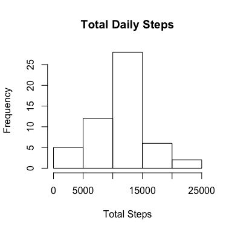
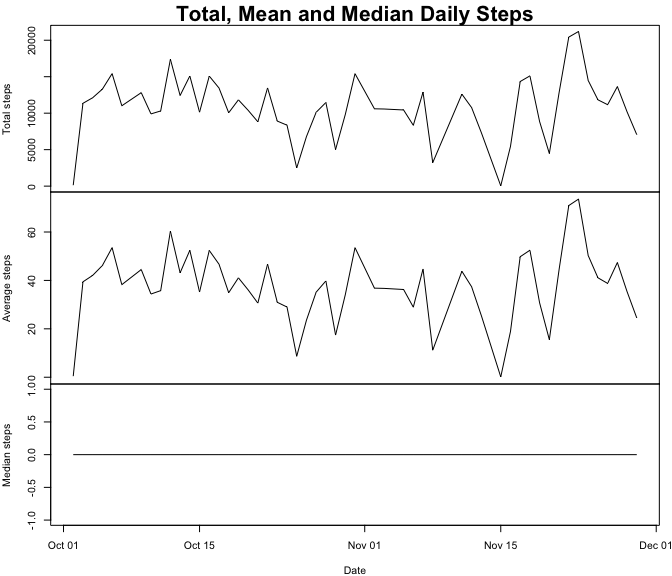
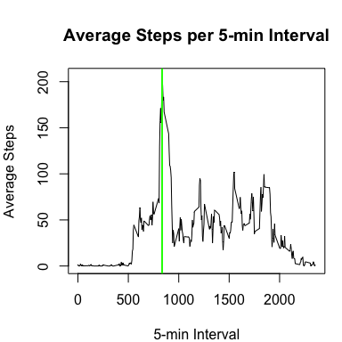
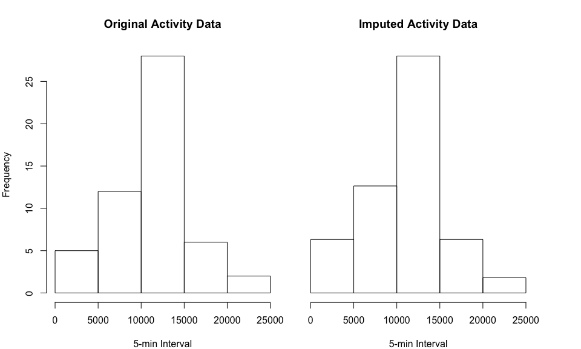
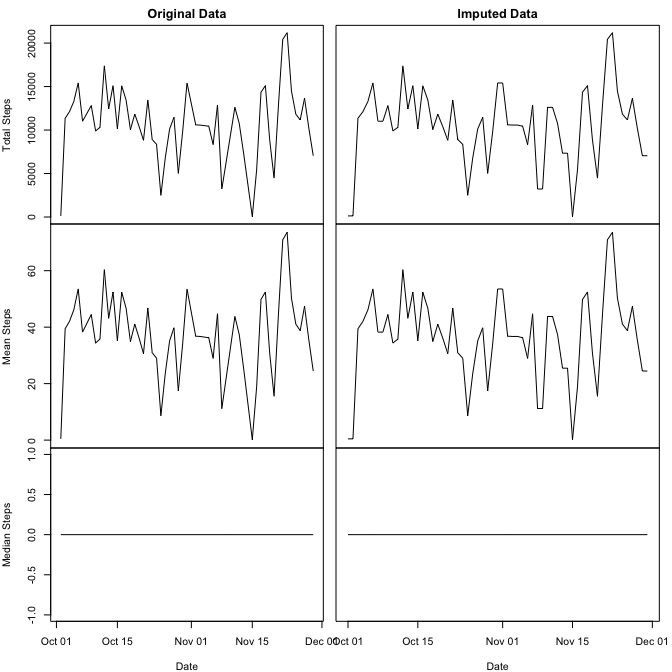

# Reproducible Research: Peer Assessment 1


## Loading and preprocessing the data
Load data and reformating character date (format "%Y-%m-%d") into Date object:

```r
activity      <- read.csv("activity.csv")
activity$date <- as.Date(activity$date, "%Y-%m-%d")
str(activity)
```

```
## 'data.frame':	17568 obs. of  3 variables:
##  $ steps   : int  NA NA NA NA NA NA NA NA NA NA ...
##  $ date    : Date, format: "2012-10-01" "2012-10-01" ...
##  $ interval: int  0 5 10 15 20 25 30 35 40 45 ...
```
  
## What is mean total number of steps taken per day?

Calculate Daily activity grouped by date and summirized with total, mean and median, remove NAs values:

```r
library(dplyr)
daily <- activity               %>%
        group_by(date)          %>%
        summarize(
                total =sum(steps, na.rm = TRUE), 
                mean  =mean(steps, na.rm = TRUE),
                median=median(steps, na.rm = TRUE)
                )               %>%
        filter(complete.cases(.))
```

Ploting histogram of total daily steps per 5-min interval :

```r
hist(daily$total,
     main = "Total Daily Steps per Interval",
     xlab = "Daily 5-min interval",
     ylab = "Total steps frequency"
     )
```



The mean and median total number of steps taken per day are shown in next plot:

```r
# Set plot panels arrangement and main title size
par(mfrow = c(3, 1), cex.main=2)

par(mar = c(0, 4, 2, 1))
with(daily, plot (date, total, type="l",
                  main = "Total, Mean and Median Daily Steps",
                  ylab = "Total steps",
                  xaxt="n"
                  )
     )
par(mar = c(0, 4, 0, 1))
with(daily, plot (date, mean, type="l",
                  ylab = "Average steps",
                  xaxt="n"
                  )
     )

par(mar = c(4, 4, 0, 1))
with(daily, plot (date, median, type="l",
                  ylab = "Median steps",
                  xlab = "Date"
                  )
     )
```



## What is the average daily activity pattern?
Calculate the average number of steps taken daily, in 5-minute intervals:

```r
average <- activity             %>%
        group_by(interval)      %>%
        summarize(avg=mean(steps, na.rm = TRUE))

# Get the interval where average steps is maximum
maxInterval <- average[average$avg == max(average$avg),]$interval
maxInterval
```

```
## [1] 835
```

Plot the Average Steps per 5-min interval; identifying the interval where number of steps is the maximum:

```r
par(mfrow = c(1,1), mar = c(4,4,4,1))

with(average, plot (interval, avg, type="l",
                    main = "Average Steps per 5-min Interval",
                    ylab = "Average Steps",
                    xlab = "5-min Interval"
                    )
     )
abline(v=maxInterval, lwd = 2, col="green")
```



## Imputing missing values
The total number of missing values are:

```r
missingValues <- sum(is.na(activity$steps))
missingValues
```

```
## [1] 2304
```
As you can see next, there are 8 days with missing values of whole day (288 5-min intervals per day). For such, using average of same, previous or next hour of same missing day could not be possible as there are no values for the entire day.

```r
activity %>% 
        group_by(date)          %>% 
        filter(is.na(steps))    %>% 
        summarize(total_missing=n())
```

```
## Source: local data frame [8 x 2]
## 
##         date total_missing
##       (date)         (int)
## 1 2012-10-01           288
## 2 2012-10-08           288
## 3 2012-11-01           288
## 4 2012-11-04           288
## 5 2012-11-09           288
## 6 2012-11-10           288
## 7 2012-11-14           288
## 8 2012-11-30           288
```

So that the strategy will be to impute average value of 5-min intervals of previous day, if available, or next day, if not available.

Obtaining the average steps per 5-min interval, NAs will be added where missing data is found.
Append a character key equals to **date** concatenated to **interval**. This key will be used to join interval averages to original activity data.


```r
intervalAvg <- activity %>%
        group_by(date,interval) %>%
        summarize(intervalMean=mean(steps)) %>%
        
        # Add a Join key (date+interval) to append to master data
        mutate (keyInterval=paste(as.character(date), as.character(interval),sep="-"))

intervalAvg
```

```
## Source: local data frame [17,568 x 4]
## Groups: date [61]
## 
##          date interval intervalMean   keyInterval
##        (date)    (int)        (dbl)         (chr)
## 1  2012-10-01        0           NA  2012-10-01-0
## 2  2012-10-01        5           NA  2012-10-01-5
## 3  2012-10-01       10           NA 2012-10-01-10
## 4  2012-10-01       15           NA 2012-10-01-15
## 5  2012-10-01       20           NA 2012-10-01-20
## 6  2012-10-01       25           NA 2012-10-01-25
## 7  2012-10-01       30           NA 2012-10-01-30
## 8  2012-10-01       35           NA 2012-10-01-35
## 9  2012-10-01       40           NA 2012-10-01-40
## 10 2012-10-01       45           NA 2012-10-01-45
## ..        ...      ...          ...           ...
```

In order to obtains previous and next day averages, we will shift 288 intervals (one full day's data) down or up, filling with NAs the head or tail:  

```r
# Append previous day intervals' means column to interval averages
intervalAvg$prevDayIntervalMean <- 
        c(rep(NA,288), intervalAvg[1:(nrow(intervalAvg)-288),]$intervalMean)

# Append next day intervals' means column to interval averages
intervalAvg$nextDayIntervalMean <- 
        c(intervalAvg[289:nrow(intervalAvg),]$intervalMean,rep(NA,288))

intervalAvg
```

```
## Source: local data frame [17,568 x 6]
## Groups: date [61]
## 
##          date interval intervalMean   keyInterval prevDayIntervalMean
##        (date)    (int)        (dbl)         (chr)               (dbl)
## 1  2012-10-01        0           NA  2012-10-01-0                  NA
## 2  2012-10-01        5           NA  2012-10-01-5                  NA
## 3  2012-10-01       10           NA 2012-10-01-10                  NA
## 4  2012-10-01       15           NA 2012-10-01-15                  NA
## 5  2012-10-01       20           NA 2012-10-01-20                  NA
## 6  2012-10-01       25           NA 2012-10-01-25                  NA
## 7  2012-10-01       30           NA 2012-10-01-30                  NA
## 8  2012-10-01       35           NA 2012-10-01-35                  NA
## 9  2012-10-01       40           NA 2012-10-01-40                  NA
## 10 2012-10-01       45           NA 2012-10-01-45                  NA
## ..        ...      ...          ...           ...                 ...
## Variables not shown: nextDayIntervalMean (dbl)
```

Now, with original activity data, create joint key (**date** + **interval**) and then left join it with interval averages (**intervalAvg**):

```r
# Create values to impute plus join key (date+interval)
impute <- activity      %>%
        mutate(keyInterval=paste(as.character(date), as.character(interval),sep="-")
               )        %>%
        
        # Left join interval's means
        left_join(intervalAvg, by="keyInterval")       
```

Impute values on NAs steps first by previous day interval average and remaining NAs, by next day interval averages:

```r
# Impute NA steps first with previous day interval means
impute[is.na(impute$steps),]$steps <- 
        impute[is.na(impute$steps),]$prevDayIntervalMean

# Impute NA steps secondly with next day interval means
impute[is.na(impute$steps),]$steps <- 
        impute[is.na(impute$steps),]$nextDayIntervalMean
```

Clean up new data dataset selecting only **date**, **interval** and **steps** colums:

```r
impute <- select(impute, date=date.x, interval=interval.x, steps)

head(impute)
```

```
##         date interval steps
## 1 2012-10-01        0     0
## 2 2012-10-01        5     0
## 3 2012-10-01       10     0
## 4 2012-10-01       15     0
## 5 2012-10-01       20     0
## 6 2012-10-01       25     0
```

Calculate the new daily average steps per interval of new imputed data set:

```r
dailyI <- impute                %>%
        group_by(date)          %>%
        summarize(
                total=sum(steps), 
                mean=mean(steps),
                median=median(steps)
        )
```

Compare original and new data set's histograms:

```r
par(mfrow = c(1,2))

par(mar = c(4,4,4,1))
hist(daily$total,
     main = "Original Activity Data",
     xlab = "5-min Interval",
     ylab = "Frequency"
     )

par(mar = c(4,1,4,4))
hist(dailyI$total,
     main = "Imputed Activity Data",
     xlab = "5-min Interval",
     ylab = NULL,
     yaxt = "n"
     )
```




Comparing the total, mean and median of original and new imputed dataset, we can perceive that there is not much impact in resulting estimates:

```r
par(mfrow = c(3, 2))

par(mar = c(0,4,2,1))
with(daily, plot (date, total, type="l",
                  main = "Original Data",
                  xaxt = "n",
                  ylab = "Total Steps"                  
                  )
     )

par(mar=c(0,0,2,1))
with(dailyI, plot (date, total, type="l",
                  main = "Imputed Data",
                  xaxt="n",
                  yaxt="n"
                )
        )

par(mar = c(0,4,0,1))
with(daily, plot (date, mean, type="l",
                  xaxt = "n",
                  ylab = "Mean Steps"                  
                  )
     )

par(mar=c(0,0,0,1))
with(dailyI, plot (date, mean, type="l",
                   xaxt="n",
                   yaxt="n"
                   )
     )

par(mar = c(4,4,0,1))
with(daily, plot (date, median, type="l",
                  ylab = "Median Steps",
                  xlab = "Date"
                  )
     )

par(mar=c(4,0,0,1))
with(dailyI, plot (date, median, type="l",
                   yaxt="n",
                   xlab = "Date"
                   )
     )
```



## Are there differences in activity patterns between weekdays and weekends?
Calulate the days patter per weekday or weekend, based on a factor variable. Then group by day and interval, and and summirize calculating mean steps:

```r
daysPattern <- impute                   %>%
        mutate(day=as.factor(ifelse(weekdays(date) == "Saturday" | weekdays(date) == "Sunday",
                              "weekend",
                              "weekday"))
               )                        %>%
        group_by(day, interval)         %>%
        summarize(mean=mean(steps))
```

Compare both plots days averages:

```r
par(mfrow = c(2, 1))

par(mar = c(0, 4, 2, 1))
with(daysPattern[daysPattern$day == "weekend",], 
     plot(interval, mean, type = "l",
          main = "Weekend",
          xaxt="n",
          ylab = "Mean Steps",
          ylim=c(0, 200)
          )
     )

par(mar=c(4,4,2,1))
with(daysPattern[daysPattern$day == "weekday",],  
     plot(interval, mean, type = "l",
          main = "Weekday",
          ylab = "Mean Steps",
          xlab = "5-min Interval",
          ylim=c(0, 200)
          )
     )
```


